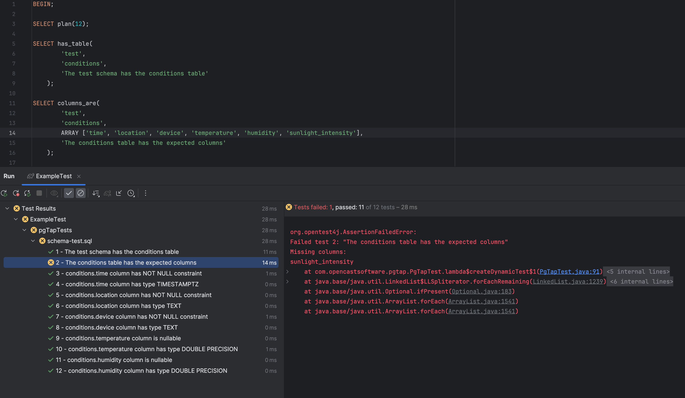

# pgtap-java

[](https://github.com/opencastsoftware/pgtap-java/actions/workflows/ci.yml)
[](https://search.maven.org/search?q=g%3Acom.opencastsoftware+AND+a%3Apgtap-java)
[](https://spdx.org/licenses/Apache-2.0.html)

A library for running [pgTAP](https://pgtap.org/) tests using [Testcontainers for Java](https://java.testcontainers.org/).



## Installation

*pgtap-java* is published for Java 11 and above.

Gradle (build.gradle / build.gradle.kts):
```kotlin
testing {
    suites {
        val test by getting(JvmTestSuite::class) {
            dependencies {
                implementation("com.opencastsoftware:pgtap-java:0.1.0")
            }
        }
    }
}
```

Maven (pom.xml):
```xml
<dependency>
    <groupId>com.opencastsoftware</groupId>
    <artifactId>pgtap-java</artifactId>
    <version>0.1.0</version>
    <scope>test</scope>
</dependency>
```

## Usage

*pgtap-java* is intended for use with [JUnit 5](https://junit.org/junit5/) and [Testcontainers for Java](https://java.testcontainers.org/).

In order to run pgTAP tests with *pgtap-java*, you must extend the [PgTapTest](./src/main/java/com/opencastsoftware/pgtap/PgTapTest.java) abstract class provided by this library.

`PgTapTest` requires 3 constructor parameters:

* `database: PostgreSQLContainer<?>` - a [Testcontainers PostgreSQL](https://java.testcontainers.org/modules/databases/postgres/) database container. This container image must have pgTAP preinstalled. See our [postgres-with-pgtap](https://github.com/opencastsoftware/postgres-with-pgtap/blob/main/Containerfile) Containerfile for an example of how you can do that.
* `pgTapTestPath: Path` - the path to your pgTAP `.sql` test files
* `pgTapTmpPath: Path` - the path where the pgTAP `.sql` test files will be mounted inside the PostgreSQL container.
 
In order for your tests to run, you should use [withCopyFileToContainer](https://javadoc.io/static/org.testcontainers/testcontainers/1.19.4/org/testcontainers/containers/GenericContainer.html#withCopyFileToContainer-org.testcontainers.utility.MountableFile-java.lang.String-) to mount the `pgTapTestsPath` at `pgTapTmpPath` in your `database` container.

It doesn't matter precisely what `pgTapTmpPath` you use, as long as you use the same path in the constructor of `PgTapTest` and with `withCopyFileToContainer`.

See [ExampleTest](./src/test/java/com/opencastsoftware/pgtap/ExampleTest.java) for an end-to-end example that uses Flyway migrations to set up a test database.

## Acknowlegements

This project wouldn't exist without the work of [theory](https://github.com/theory), [rnorth](https://github.com/rnorth) and the many pgTAP and Testcontainers contributors.

## License

All code in this repository is licensed under the Apache License, Version 2.0. See [LICENSE](./LICENSE).
